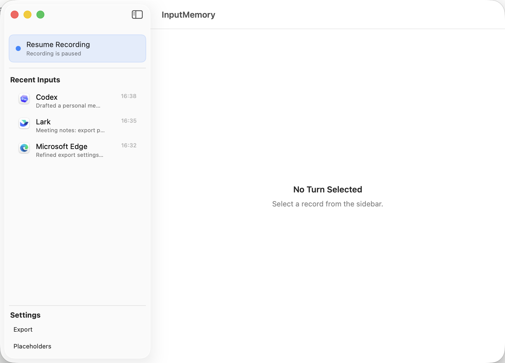

# InputMemory

InputMemory is a local macOS app for building a personal input memory layer. Its goal is to record the text a user types across their computer, so those inputs can later be organized into a unique personal memory and connected to LLM-powered products to improve the user experience.

Recording is the means, not the end goal. InputMemory focuses on local capture, storage, viewing, placeholder filtering, and Markdown export. It does not summarize, upload, or analyze your data.



## Status

InputMemory is an MVP and an experimental local-first macOS app. It works for the current target workflow, but it should not be treated as a polished or security-audited product.

## Vibe Coding Notice

This project was built with a vibe coding workflow and substantial AI assistance. Please review the code carefully before using it for sensitive workflows or building on top of it.

## Features

- Captures focused text input through macOS Accessibility.
- Records app name, bundle ID, window title, control metadata, timestamps, status, and one user-input text field: `observed_text`.
- Stores records locally in SQLite.
- Shows recent inputs in a native macOS sidebar.
- Supports pause/resume recording from the main window or menu bar.
- Filters empty, invisible zero-width text, secure fields, and configured placeholder text.
- Lets users configure app-specific placeholders from recent records.
- Exports Markdown for the previous day automatically.
- Supports manual Markdown export for a selected date range.
- Bundles a generated macOS `.icns` app icon.

## Non-Goals

InputMemory intentionally does not:

- Record raw keyboard events.
- Record clipboard history.
- Record audio or speech.
- Use OCR or screen scraping.
- Send captured text to a server.
- Generate memory summaries with an LLM.

## Requirements

- macOS 14 or later.
- Xcode command line tools or Xcode.
- Swift Package Manager.
- Accessibility permission for `InputMemory`.

If SwiftPM cannot find XCTest, run commands with:

```bash
DEVELOPER_DIR=/Applications/Xcode.app/Contents/Developer
```

## Build and Run

Generate or refresh the app icon:

```bash
./script/generate_app_icon.swift
```

Build, package, sign locally, and launch:

```bash
./script/build_and_run.sh
```

The built app is written to:

```text
dist/InputMemory.app
```

## Permissions

InputMemory requires macOS Accessibility permission to read focused text controls from other apps.

If permission is missing, the app still opens, but recording is disabled. Use the in-app `Accessibility Required` prompt to open System Settings, then grant permission to InputMemory.

## Usage

1. Launch InputMemory.
2. Grant Accessibility permission when prompted.
3. Click `Resume Recording`.
4. Use your Mac normally.
5. Review captured input in `Recent Inputs`.
6. Add placeholder rules in `Settings -> Placeholders` when an app replaces sent text with default text.
7. Export Markdown from `Settings -> Export`, or let the daily export run automatically.

## Data Locations

All data is local.

SQLite database:

```text
~/Library/Application Support/InputMemory/input_memory.sqlite
```

Placeholder rules:

```text
~/Library/Application Support/InputMemory/placeholders.json
```

Markdown exports:

```text
~/Documents/InputMemory/
```

App icon resources:

```text
Resources/InputMemory-1024.png
Resources/InputMemory.iconset/
Resources/InputMemory.icns
```

## Export Behavior

Automatic export writes the previous calendar day.

Manual export lets you select a start date and end date in the main window under:

```text
Settings -> Export
```

Each day in the selected range is exported as its own Markdown file.

Exported Markdown files are named:

```text
YYYY-MM-DD.md
```

## Placeholder Rules

Some apps replace sent text with default placeholder text after submission. InputMemory can ignore those placeholders so they do not overwrite the real input.

Configure placeholders in:

```text
Settings -> Placeholders
```

You can manually enter:

- Scope: `This App` or `All Apps`
- App Name
- Bundle ID
- Placeholder Text
- Regular Expression, for rules that should match a pattern

Or select a recent input and use `Use Selected Turn`.

## Development

Run tests:

```bash
DEVELOPER_DIR=/Applications/Xcode.app/Contents/Developer swift test
```

Build without launching:

```bash
DEVELOPER_DIR=/Applications/Xcode.app/Contents/Developer swift build
```

Run the lightweight self-test:

```bash
DEVELOPER_DIR=/Applications/Xcode.app/Contents/Developer swift run InputMemorySelfTest
```

## Debug Logs

InputMemory writes debug telemetry to macOS Unified Logging with subsystem:

```text
local.inputmemory
```

Stream all InputMemory logs:

```bash
/usr/bin/log stream --style compact --predicate 'subsystem == "local.inputmemory"'
```

Inspect recent export logs:

```bash
/usr/bin/log show --last 1h --style compact --predicate 'subsystem == "local.inputmemory" && category == "export"'
```

Inspect recent capture logs:

```bash
/usr/bin/log show --last 1h --style compact --predicate 'subsystem == "local.inputmemory" && category == "capture"'
```

Log categories include `lifecycle`, `permission`, `capture`, `turn`, `store`, `export`, `placeholder`, and `diagnostics`.

Logs are intended for debugging. They do not include raw `observed_text`; text values are represented with length and hash prefix. Window titles and local paths are marked private in Unified Logging.

## Troubleshooting

If recording does not work, check macOS Accessibility permission for InputMemory and restart the app after granting permission.

If the app records placeholder text after sending a message, add that text under `Settings -> Placeholders`.

If empty-looking rows appear, they may be historical records containing invisible zero-width characters. New captures filter those out, and recent input/export views skip them.

If tests fail with `no such module XCTest`, run SwiftPM with:

```bash
DEVELOPER_DIR=/Applications/Xcode.app/Contents/Developer swift test
```

If the app icon does not refresh after rebuilding, quit the app and relaunch `dist/InputMemory.app`. macOS may cache icons briefly.

## Contributing

This is currently a personal MVP. Issues, suggestions, and small focused pull requests are welcome, especially around capture reliability, export format, UI polish, and privacy safeguards.

## Project Structure

```text
Sources/InputMemory/          macOS app, state, and SwiftUI views
Sources/InputMemoryCore/      capture, storage, export, and policy logic
Sources/InputMemorySelfTest/  lightweight runtime self-test
Tests/InputMemoryTests/       XCTest coverage
Resources/                    generated icon assets
script/                       local build and icon generation scripts
docs/                         design notes and implementation plans
```

## Privacy Notes

InputMemory can capture sensitive text if a focused text control exposes it through Accessibility. The app skips secure text fields where macOS marks them as secure, but users should still pause recording when working with sensitive content.

Captured data stays on the local machine unless you manually share, sync, or export it.
